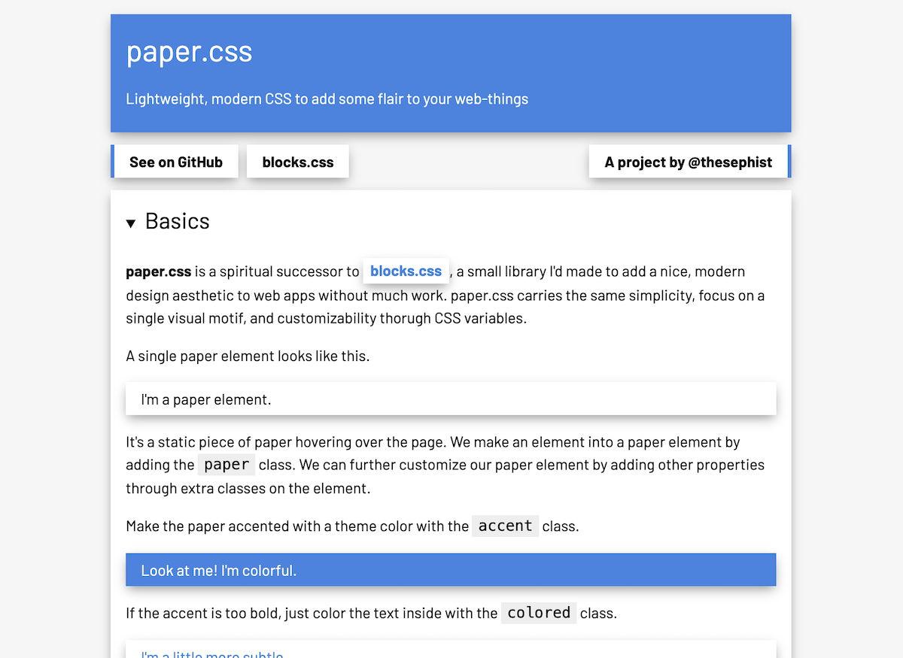

# paper.css 📜

Lightweight, modern CSS to add some flair to your web-things. paper.css is a spiritual successor to [blocks.css](https://github.com/thesephist/blocks.css).

You can check out examples and get started with **paper.css** on the [GitHub Page 📖](https://thesephist.github.io/paper.css/). Here's what a paper.css UI looks like, from the documentation.



Start by adding the paper.css stylesheet to your page's `<head>`:

```
<link rel="stylesheet" href="https://unpkg.com/blocks.css/dist/paper.min.css" />
```

